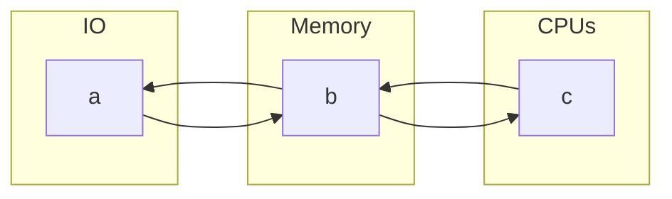

### פרק 1


#### 1.1 Intoduction

---

###### Example

A grid is comprised from a series of antennas. A stable grid is a grid with no two consecutive broken antennas.

 Assuming two antennas are the same iff they are both broken / functional, and $n$ antennas from which $m$ are broken, how many stable grids are there?

<u>Answer</u>

$\binom{n-m+1}{m}$


#### 1.2 Product Rules

---

Assume $r$ tests, with $m_i$ outcomes for each test.

We define a test $R=r_1, r_2,..., r_n$.

Then $R$ has $\prod\limits_{i=1}^{n}m_i$ outcomes.

###### Example

There are $2^{n}$ different functions $F:\{1,...,n\}\mapsto \{0,1\}$.


#### 1.3 Permutations

---

###### Examples

1. A class with $10$ students ($4$ women, 6 men) is been graded.

   - Assuming every grade is unique, how many different gradings are there?

     $10!$

   - Assuming we grade the men and women separately, with unique grades, how many different gradings are there?

     $6!\cdot 4!$

2. Given the letters P,E,P,P,E,R, how many different words are there?

   $\frac{6!}{3!\cdot2!\cdot1!}$


##### Lemma

If $n=n_1 + \cdot \cdot \cdot + n_k$, and there are $n_1,...,n_k$ identical objects.

The number of different permutations is $\frac{n!}{n_1!\cdot\cdot\cdot n_k!}$.

###### Example

A tournament of $10$ players is held, $4$ Brazilian, $6$ Americans.

The final score sheet display the nationalities alone. How many options are there?

$\frac{10!}{4!6!}$.


#### 1.4 Combinations

---

How many groups of size $r$ we can choose from a group of order $n$?

Groups of order $r$ from $\{1,...,n\}$ = $(n)(n-1)\cdot\cdot\cdot(n-r+1)$.


There are $\frac{n!}{}$

Given $10$ different gr


###### Units

| unit      | bytes    | unit     | bytes     |
| --------- | -------- | -------- | --------- |
| kilobyte  | $2^{10}$ | kibibyte | $10^3$    |
| megabyte  | $2^{20}$ | mebibyte | $10^6$    |
| gigabyte  | $2^{30}$ | gibibyte | $10^9$    |
| terabyte  | $2^{40}$ | tebibyte | $10^{12}$ |
| petabyte  | $2^{50}$ | pebibyte | $10^{15}$ |
| exabyte   | $2^{60}$ | exbibyte | $10^{18}$ |
| zettabyte | $2^{70}$ | zebibyte | $10^{21}$ |


1. PMD - Personal Mobile Device

2. Cloud Computing - Types of services running at cloud data-centers.

3. Saas - Software as a Service, i.e Google Search.

4. WSC - warehouse-scale computer. The types of dynamically allocated servers at cloud data-centers.


###### Questions

- How High Level Languages are translated to hardware instructions?
- How does the software and hardware interact?
- How does performance is measured? 
- Modern Computer Design. How to improve hardware performance?
- The reason for moving towards parallel computing.


###### Understanding Program Performance

A program performance may be effected by:

- Effectiveness of algorithms in the program
- Efficiency of compilers translating the program
- Efficiency of the hardware executing the translated program

| HW/SW                                 | Effects                                  | Ch          |
| ------------------------------------- | ---------------------------------------- | ----------- |
| Algorithm                             | Total number of actions / Complexity     | Other Books |
| Compiler / Arc / Programming Language | The number of instructions per statement | 2,3.        |
| Processor / Memory                    | Speed of instructions executations       | 4,5.6       |
| I/O System                            | Speed of I/O operations                  | 4,5,6.      |


######  Check Yourself

Both software and hardware affect the performance of a program. Can you think of examples where each of the following is the right place to look for a performance bottleneck?

1. Algorithm - Should exploit the hardware in the best manner. For example, a concurrent algorithm might run faster on a multi-core machine, rather than a serial algorithm.

2. Programming Language or Compiler - Since the both are dependent on hardware implementation and architecture, it's very likely that performance may be affected by them.

3. OS - Since user application programs relay on the kernel to facilitate communication with the hardware, the os performance is intrinsic with the user level performance.

4. Processor - The processor architecture and implementation are the foundation of the computation, therefore they are crucial for good performance.

   For example, instructions using footling point arithmetics will run much slower than instructions using basic integers.

5. I/O and devices.


#### 1.2 Great Ideas in Computer Arc

---

##### Design for Moore's Law

Integrated circuit resources double every 18-24 mounts.

Computer Design can take years, the resources avbailable per chip can easilt double or quadruple between the start and finish of a project. So computer architects must anticipate where the technology will be when the design finishes.


##### Exploiting Abstraction

Using abstraction techniques for higher level design.


##### Make the Common Case Fast

Optimizing the common case, rather than the rare one. Even though the common case might be simpler than the rare one.

You know what the common case is be measurements, therefore it is also more suitable for optimization.

It's easier to optimize what you know thoroughly, rather than a scarce case you are not fully comprehend. 


##### Performance via Parallelism

...


##### Performance via Pipelining

It is parallelism in the instructions executions level.


##### Performance via Prediction

It might be faster in average to guess and start working rather than wait until you know for sure.


##### Hierarchy of Memories

The fastest smallest and, most expensive memory per bit at the top of the hierarchy,

and the slowest, larges, and cheapest per bit at the bottom.


##### Dependability via Redundancy

We improve the Dependability of computers by introducing Redundancy technics, addressing local components failures.


#### 1.3 Below your Program

##### Operating System

- Handling basic I/O operations
- Allocating storage and memory
- Providing for protected sharing of the computer among multiple applications.

##### Compiler

- Binary
- Instruction - Basic function a cpu provide.
- Assembler - A program which taking assembly instructions, and generating machine code.
- Assembly - The collection of cpu arc instructions.
- Machine Language - The binary form of instructions.


Higher Level Languages introduce:

- Abstraction thinking
- Target specific designed languages (i.e Lisp is aimed for symbol manipulation)
- Eliminates dependence on computer arc.


#### Under the Covers

---

The five classics components of a computer are:

- Input
- Output
- Memory
- Data-path & Control $\cong$ Processor



1. Integrated circuit / Chip

2. Processor / CPU

3. Data-path

4. Control

5. DRAM

6. Cache Memory
7. SDRAM


1. Instruction Set Architecture - Descriptions of the commands a cpu provide.

2. Application Binary Interface - Covers:
   - A processor instruction set.
   - Size, Layours, Alignments of basic data types that a processor can directly access.
   - The calling convections which determines how arguments are passed to functions.
   - The binary format of object files, program libraries, and so on.


- volatile memory
- non-volatile memory

- main memory -> volatile memory / runtime memory
- secondary memory -> non-volatile memory / storage

- flash memory


1. Local Area Netwrok (LAN)
2. Wide Are Netwrok (WAN)


1 second = $10^3$ milliseconds = $10^6$ microseconds = $10^9$ nanoseconds.


#### Technologies for Building Processors and Memory

---

- Transistor - on/off switch triggered by electricity
- Integrated Circuit - combines transistors  to a single chip
- VLSI - very large-scale integrated circuit - Combined from billions of conductors, isolators, and transistors.


To manufacture a chip, we start with silicon.

Silicon is a semi conductor.

A chemical process transforms parts into one of three devices:

- Excellent conductors
- Excellent insulators
- Areas that can conduct or insulate under special conditions


The process is described in 26/27


#### Performance

---

##### Defining Performance

The objective of performance may from one use case to the other.

For a personal user, a serial execution time speed might by more important than throughput.

For a Data-center manager, throughput might be more important concerned.

So we have different performance matrices, to best measure each use case.

###### Remark

In the next few chapters we will mainly discuss performance in the context of execution time.


###### Terminology

Performance = $\frac{1}{Execution Time}$.

A is $n$ times faster than B - $\frac{Performance_A}{Performance_B}=n$.

A is $n$ times as fast as B - $\frac{ExecutionTime_B}{ExecutionTime_A}=n$.


###### Example

If $A$ runs a program in $10$ seconds, and $B$ runs a program in $15$ seconds,

Then $\frac{ET(B)}{ET(A)}=\frac{15}{10}=1.5$, 

$A$ is $1.5$ times as fast as $B$.

$\frac{P(A)}{P(B)}=\frac{\frac{1}{10}}{\frac{1}{15}}=1.5$.

A is $1.5$ times faster than $B$.


1. Wall-clock time / Response time / Execution time.

   The total time that takes a task to complete. Including memory access, disk access, io, kernel overhead.

2. CPU Execution Time / CPU Time.

   The time the cpu spend on a task, not including any sorts of overhead.

3. User CPU Time

   The time spent on the general task program described by the user. Not including System extra time spend to facilitate things.

4. System CPU Time

   The time spent by the kernel to facilitate system resources.


We distinct between performance based on elapsed time and based on CPU execution time.

*System performance* - refers to elapsed time on an unloaded system.

*CPU performance* - refers to user CPU time.

In this chapter  we will focus on CPU performance.


##### Understanding Program Performance

Computer designers may want to think about a computer by using a measure that relates to how fast the hardware can perform basic functions.

Almost all computers are constructed using a clock that determines when events take place in the hardware. These discrete time intervals are called clock cycles / clock tick / cycle / clock period.

Designers refer to the length of a clock period as the time for a complete clock cycle (e.g 250 picoseconds), and as the clock rate.

1. Clock Cycle

   A discrete time operation interval of the CPU.

   The CPU can work on multiple instructions each cycle.

2. Clock Rate

   The inverse of the clock period. How many cycles are performed in a second.

2. Clock Period

   The time that takes a Clock Cycle to complete.


###### Example

1. Suppose an application running on a personal mobile device and using cloud is limited by network performance. For the following changes, state whether only the throughput improves, both response time and throughput improve, or neither improves.
   - An extra network channel is added between the PMD and the cloud, increasing the total network throughput, and reducing the delay to obtain network access.
   - The networking software is improved, thereby reducing the network communication delay, but not increasing throughput.
   - More memory is added to the computer.
2. Computer C's performance is 4 times as fast the performance of a computer B, which runs a given app in 28 seconds. Then Computer C will run the app in 7 seconds.


##### CPU Performance and its Factors

If we could relate the different metrics for performance measurement., we could determine the effect of a design change on the performance as experienced by the user.

Since we are confining ourselves to CPU performance at this point , the bottom-line performance measure is CPU execution time. A simple formula relates the most basic metrics (clock cycles and clock cycle time) to CPU time:

<u>CPU Execution Time</u> = CPU Clock Cycles $\times$ Clock Cycle Time.

<u>CPU Execution Time</u> = CPU Clock Cycles $/$ Clock Rate.

This formula makes it clear that the hardware designer can improve performance by reducing the number of clock cycles required for a program or the length of the clock cycle. As we will see i later chapters, the designer often faces a trade-off between the number of clock cycles needed for a program and the length of each cycle. Many techniques that decrease the number of clock cycles may also increase the clock time.

###### Example

Our favorite program runs in 10 seconds on computer A, which has a 2GHz clock We are trying to help a computer designer build a computer B which will run this program in 6 seconds. The designer has determined that a substantial increase in the clock rate is possible, but this increase will affect the rest of the CPU design, causing computer B to require 1.2 time as many clock cycles as computer A for this program. What clock rate should we tell the designer to target?

###### Example

A program runs for $8$ seconds, with a total of $4\times 10^9$ clock cycles. What is the length of the clock period?

We know:

8 seconds = CPU Cycles $\times$ Clock Period.

Hence:

Clock Period = $\frac{8}{4\times10^{9}}=2\times 10^{-9}=$ 2 nanoseconds.


###### Example

CPU Time A = CPU Clock Cycles A \ Clock Rate.

CPU Clock Cycles A = CPU Time A $\times$ Clock Rate.

CPU Clock Cycles A = $10 \times 2\times 10^9$.

Now, our desired target for $B$, based on the question confinements, is:

$1.2 \space \times $ CPU Clock Cycles A = 6 seconds $\times$  New Clock Rate.

So we need to target the new clock rate for:

$\frac{1.2}{6} \times 10 \times 2\times 10^9=4\times 10^9=4GHz$.


##### Instruction Performance

The performance questions above did not include any reference to the number of instructions needed for the program. However, since the compiler clearly generated instructions to execute, and the computer had to execute the instructions to run the program, the execution time must depend on the number of instructions in a program. 

Since Execution Time = Total Instructions $\times$ Avg Instruction Time, we can express:

CPU Clock Cycles  = CPU Execution Time $/$ Clock Cycle Time.

​								= Total Instructions $\times$ Avg Instruction Time $/$ Clock Cycle Time.

​								= Total Instructions $\times$ (Avg Instruction Time $/$ Clock Cycle Time).

​								= Total Instructions $\times$ CPI.

Clock cycles per instruction, which is the average number of clock cycles each instruction takes to execute, is often abbreviated as **CPI**.

Since different instructions may take different amounts of time, CPI is an average of all the instructions executed in the program.

CPI provides one way of comparing two different implementations of the same instruction set architecture, since the number of instructions executed for a program will, of course, be the same.

Instruction count - The total number of instructions executed for a program.

###### Example

Suppose we have two implementations of the same instruction set architecture. 

Computer A has a clock cycle time of 250ps and a CPI 2.0 for some program.

Computer B has a clock cycle time of 500ps, and a CPI of 1.2 for the same program. Which computer is faster for this program, and by how much?

A  = Clock Cycles A $\times$ Clock Cycle Time A.

​	= (Total Instructions $\times$ CPI A) $\times$ Clock Cycle Time A.

​	= Total Instructions $\times$ (CPI A $\times$ Clock Cycle Time A).

​	= Total Instructions $\times$ (2 $\times$ 250ps).

​	= Total Instructions $\times$ 500ps.

B = Clock Cycles B $\times$ Clock Cycle Time B.

​	= (Total Instructions $\times$ CPI B) $\times$ Clock Cycle Time B.

​	= Total Instructions $\times$ (CPI B $\times$ Clock Cycle Time B).

​	= Total Instructions $\times$ (1.2 $\times$ 500ps).

​	= Total Instructions $\times$ 600ps.

Therefore $A$ is $1.2$ as fast as $B$.


##### The Classic CPU Performance Equation

CPU Time = CPU Cycles $\times$ Clock Cycle Time.

​				  = Instruction Count $\times$ CPI $\times$ Clock Cycle Time.

​				  = (Instruction Count $\times$ CPI) / Clock Rate.

###### Example

A compiler designer is trying to decide between two code sequences for a particular computer. The hardware designers have supplied the following facts:

Instructions are divided to three groups, A, B, C.

|      | Group A | Group B | Group C |
| ---- | ------- | ------- | ------- |
| CPI  | 1       | 2       | 3       |

For a particular high level language statement, the compiler writer is considering two code sequences that require the following instruction counts.

| Code Sequence | Group A Count | Group B Count | Group C Count |
| ------------- | ------------- | ------------- | ------------- |
| X             | 2             | 1             | 2             |
| Y             | 4             | 1             | 1             |

Which code sequence executes the most instructions? Which will be faster? What is the CPI for each sequence?

4 + 2 + 3 / 6

|      | Instruction Count | CPI  | CPU Time                     |
| ---- | ----------------- | ---- | ---------------------------- |
| X    | 5                 | 2    | 10 $\times$ Clock Cycle Time |
| Y    | 6                 | 1.5  | 9 $\times$ Clock Cycle Time  |

Hence $Y$ sequence runs 1.11 times faster than $X$ sequence, even though $Y$ executes one more instruction.


###### Example

A program $P$ runs for 10 seconds on computer $M$ with 1GHz rate.

Program $P$ was optimized, so each multiplication by $4$ was replaced by $2$ addition to itself operand.

The CPI of multiplication is $4$, and the CPI of addition is $1$.

After the optimization the program $P$ run for $9$ seconds. How many multiplication operands were replaced?


```
CPU Time = Clock Cycles x Cycle Period
		 = Total Instruction x CPI x Cycle Period.
```

Now let us note:

$A$ = $P$ instructions except for multiplication by $4$.

$B$ = Multiplication by $4$ instructions in $P$.

CPU Time $P_1$ = $(|A| \times CPI_A + |B| \times CPI_*) \times$ Cycle Period.


And since each multiplication by $4$ is two additions, we have:

CPU Time $P_2$ = $(|A| \times CPI_A + 2|B| \times CPI_+) \times$ Cycle Period.


Placing the stated values, we have:

10 = $(|A| \times CPI_A + |B| \times 4) \times$ $\frac{1}{10^{9}}$.

9 = $(|A| \times CPI_A + 2|B| \times 1) \times$ $\frac{1}{10^{9}}$.

So, 1 = $|B|\times 2 \times \frac{1}{10^9}$, and we have:

$|B|=0.5\times 10^9$, which is the total of multiplication by $4$ operations that were replaced.


##### The Big Picture

Time = $\frac{Seconds}{Program}=\frac{Instructions}{Program}\times\frac{Clock \space Cycle \space Time}{Instructions}\times\frac{Seconds}{Clock \space Cycle \space Time}=Instructions \times CPI \times ClockCycles$

Time = Clock Cycles x Clock Cycle Time

​		  = Instructions x CPI x Clock Cycle Time


The above example shows the danger of unisng only one factor (i.e instruction count) to assess performance. When comparing two computers, you must look at all three componenets, which combine to form execution time. If some of the actors are identical, like the clock rate in the above example, performance can be determined ny comparing all the nonidentical factors.


CPI varies by instruction mix, therefore both instruction count and CPI must be compared.


##### Understanding Program Performance

The performance of a program depends on the algorithm, the language, the compiler, the architecture, and the actual hardware. The following table summarizes how these components affect the factors in the CPU performance equation.


p. 39

| Component                    | Affects                             | How  |
| ---------------------------- | ----------------------------------- | ---- |
| Algorithm                    | Instruction count, possibly CPI.    |      |
| Programming Language         | Instruction count, CPI.             |      |
| Compiler                     | Instruction count, CPI.             |      |
| Instruction set architecture | Instruction count, CPI, Clock Rate. |      |


###### Elaboration

- Although one may expect that the minimum CPI is 1.0, as we'll see in Chapter 4, some processor fetch and execute multiple instructions per clock cycle.
- Today's modern CPU can vary their clock rates, so we should need to use the average clock rate for a program.


###### Example

A given application written in Java runs 15 seconds on a PC processor.

A new Java compiler decreases the instruction to 60% percent, and increase the PCI by 1.1.

How fast can we expect the application to run using the new compiler? 


$A$ = Instructions

$B$ = CPI

AppTime = 15 sec = |A| x |B| x Clock Cycle Time.

New Time = 0.6 x |A| x 1.1 x |B| x Clock Cycle Time.

​				   = 0.66 x 15 = 9.9 sec.


###### Example

A company is looking into improving performance by adding support for Hardware Garbage Collector.

Currently, Garbage Collection is 20% of the instruction count. The company can choose one of two ways:

1. Move Garbage Collection to the Hardware.
   - New Instruction count will be 80% of the original.
   - Clock Cycle will be 1.2 times longer of the original.

2. Add new instructions which facilitate garbage collection.
   - Only half of the Garbage Collection Instructions will remain.
   - The Clock Cycle Time will be 1.1 times longer of the original.

Which option should you choose?


Assuming the CPI is not affected.

Time1 = Instruction Count x 0.8 x CPI x Clock Cycle Time x 1.2

Time2 = Instruction Count x 0.9 x CPI x Clock Cycle Time x 1.1

Time1 = Time x 0.96

Time2 = Time x 0.99


#### 1.8 The Power Wall

---

###### Energy

Energy is the ability to cause change. Base unit is joule.

The capacity to do work. Time is not relevant. There are different types of Energy. 

###### Power

Power is the rate energy is moved. The amount of energy divided by the time it took to use the energy.

The unit is watt, which is one joule per second.

My car's battery can provide 500 amps at 12 volts, which equals 6kW of power.


The dominant technology for integrated circuits is called CMOS (complementary metal oxide semiconductor). For CMOS, the primary source of energy consumption is so-called dynamic energy - that is, energy that is consumed when transistors switch states from 0 to 1, and cive versa. 


###### Transition Energy

The dynamic energy depends on the capacitive loading of each transistor and the volrage applied:

Energy $\cong Capacitive \space Loading \times Voltage^2$.

This equation is the energy of pulse during the logic transition of 0->1->0, or 1->0->1. So the energy of a single transition is:

Energy $\cong \frac{1}{2} \times Capacitive \space Loading \times Voltage^2$.

The power required per transistor is just the product of energy of a transition and the frequency of transitions:

Power $\cong \frac{1}{2} \times Capacitive \space Loading \times Voltage^2 \times Frequency \space Switched$.

###### Terms

Frequency switched is a function of the clock rate.

The capacitive load per transistor is a function of both the number of transistors connected to an output (called the fanout) and the technology, which determines the capacitance of both wires and transistors.

As energy efficiency increased, the power consumption of CPU's alleviated moderately, even thought the clock rates grow substantially.

###### Example

Suppose we developed a new, simpler processor that has 85% of the capacitive load of the more complex older processor. Further, assume that it has adjustable voltage so that it can reduce voltage 15% compared to processor B, which results in a 15% shrink in frequency. What is the impact on dynamic power?

- The new capacitive load is 0.85 of the old one.
- The adjustable voltage let us use 0.85 of the previous voltage rate.
- The adjustable voltage decrease frequency by a factor of 0.85.

$$
\frac{Power \space New}{Power \space Old} = \frac{\frac{1}{2} \times (Capacitive \space Loading \times 0.85)\times (Voltage^2 \times 0.85) \times (Frequency \space Switched\times 0.85)}{\frac{1}{2} \times Capacitive \space Loading \times Voltage^2 \times Frequency \space Switched}=0.85^4
$$

Hence the new Power consumption is $\sim 0.52$ of the original.


The design of processor was slammed into a power wall.

- Complex design
- Vast amount of new transistors
- Voltage low barrier

eventually yield a too much of power consumption.

This power wall forced designers to find a new way to move forward.


#### (1.8) The Switch from Uniprocessors to Multiprocessors

---

The transition to Multicore Microchips.

As of 2006, all tech companies build chips with multiple processors working simultaneity.

For the sake of clarity, each **single processor** on chip is **addressed as core**, and the entire **chip** is **addressed as multi-core microchip.**

For example, a quadcore microprocessor is a chip that contains four processors / cores.


##### Hardware Software Interface

Chapter 4 will explain pipelining, which is an elegant technique that runs programs faster by overlapping the execution of instructions. This one example of instruction-level parallelism.

Today, the move to muticore microchips forces programmers to write parallel programs.


##### Sea Change Different Aspects

To reflect this sea change in the industry (i.e The move to multicore microchips), each of the next five chapters in this book will devote a section to the implications of the parallel revolution.

- 2.11 - Parallelism and Instructions: Synchronization.
- 3.6 - Parallelism and Computer Architect - Subword parallelism.
- 4.10 - Parallelism via Instruction.
- 5.10 - Parallelism and Memory Hierarchy: Cache Coherence.
- 5.11 - Parallelism and Memory Hierarchy: Redundant Arrays of Inexpensive Disks.


###### Example

Base on the 1.17 chart, we can see the throughout the last 35 years the performance of processors grow steadily. Why did the rate of progress decreased around 2006?

- Processors designs were constantly improved. For example:

  - More Transistors
  - Complex Design

  This factors increased the power consumption.

  At 100W drastic cooling masseuses are necessary, otherwise the processor silicon melts.

  For those reasons, the design turned towards multicore micorchips.

- Currently, the usage of multicore chips is still not optimal, therefore the rate of progress has decreased.

- Access to memory does not catch up with the improved performance of microchips, hence creating a bottleneck.


#### Real Stuff: Benchmarking the Intel Core i7

---

SPEC (System Performance Evaluation Cooperative) is an effort funded  and supported by a number of computer vendors to create standard sets of benchmarks for modern computer systems.

SPEC89 is a benchmark focused on processor performance.

The latest is SPEC CFP2006 which consists of a set of 12 integer benchmarks (CINT2006), and 17 floating-pint benchmarks (CFP2006).

The integer benchmarks vary from part of a compiler to a chess program.

The floating point benchmarks include structured dynamics, and sparse linear algebra codes for fluid dynamics.

Figure 1.18 layout the SPEC integer benchmarks and their results on the Intel Core i7.

- Reference Time is provided by SPEC, and refers to the required time of some fixed processor.
- SPECratio is the reference time divided by execution time.
- High SPECratio indicate high performance.

| description                   | name  | instruction_count | cpi  | clock_cycle_time | execution_time | reference_time | SPECratio |
| ----------------------------- | ----- | ----------------- | ---- | ---------------- | -------------- | -------------- | --------- |
| Interpreted String Processing | perl  | 2252 x 10^9       | 0.6  | 0.376 / 10^9     | 508            | 9770           | 19.2      |
| Block-sorting compresiion     | bzip2 | 2390 x 10^9       | 0.7  | 0.376 / 10^9     | 629            | 9650           | 15.4      |
| GNU c compiler                | gcc   |                   |      |                  |                |                |           |
| Combinatorial optimization    | mcf   |                   |      |                  |                |                |           |
| Go game (AI)                  | go    |                   |      |                  |                |                |           |


To simplify the marketing of computers, SPEC decided to report a single number processor by the execution time of the measured computer normalizes the execution time measureless; this normalization yields a measure, called the SPECratio, which has the advantage that bigger numeric results indicate faster performance. That is, the SPECratio is the inverse of execution time.

A CINT2006 or a CFP2006 summary measurement is obtained by taking the geometric mean of the SPECratios.
$$
\sqrt[\leftroot{1}\uproot{5}N]{\prod\limits_{i=1}^{N}{SPECratio_i}}
$$

##### SPEC Power Benchmark

SPEC added a power benchmark. This benchmark is:

- Power consumption at different workload levels.
- 10% power increments over a period of time.

Workload = עומס עבודה

| Target Workload | Performance (ssj_ops) | Average Power (watts) |
| --------------- | --------------------- | --------------------- |
| 100%            | 865,618               | 258                   |
| 90%             | 786,688               | 242                   |
| 80%             | 698,051               | 224                   |
| 70%             | 607,826               | 204                   |
| 60%             | 521,391               | 185                   |
| 50%             | 436,757               | 170                   |
| 40%             | 435,919               | 157                   |
| 30%             | 262,071               | 146                   |
| 20%             | 176,061               | 135                   |

$ \frac {Performance\space Sum} {Average \space Power \space Sum} = overall \space ssj \space per \space watt $


###### Example

Reference time is provided by SPEC. It is the time which takes some chosen processor to complete the task.

The SPECratio is given by dividing the reference time by execution time.

The final measure is given by the geometric mean of the SPECratios.


#### (1.10) Fallacies and Pitfalls

---

- Amdahl's Law - A performance enhancement is bound by the proportional amount of usage.

  Therefore, make improve the common case.

- Fallacy - Computers at low utilization use little Power.

  Even given five years to learn how to run the SPECpower benchmark well, the specially configured computer with the best result in 2012 still uses 33% of the peak power at 10% workload.

  From a power efficiency stand point, we can argue that hardware designers should strive to achieve energy-proportional computing.

  More power-efficient computers will yield lower electrical bills.

- Fallacy - Designing for performance and designing for energy efficiency are unrelated goals.

  Since energy is power over time, it is often the case that hardware or software optimization that take less time save energy overall even if the optimization takes a bit more energy. One reason is that all of the rest of the computer is consuming energy while the program is running.

- Pitfall - Using a substance of the performance equation as a performance metric.

  As we already seen, using a partial form of the time equation may yield false results.

  Nearly all proposed alternatives to the use of time as performance metric have led eventaally to misleading claims, distorted results, or incorrect interpertations.

  One alternative to time is MIPS (million instructions per second), which is simply:

  **MIPS** = $\frac{Instruction \space count}{Execution \space Time \times 10^6}$.

MIPS is simply an instruction execution rate. And generally, faster computers will have higher MIPS.

There are three problems with using MIPS as a measure for comparing computer.

- Does not take into account the capabilites of the instrructions. Therefore, we cannot compare computers with different instruction sets.

- MOPS varies between programs on the same computer; thus a computer cannot have a single <OPS rating.

  **MIPS** = $\frac{Instruction \space count}{Execution \space Time \times 10^6}=\frac{Clock \space Rate }{CPI \times 10^6}$.

- If a new program execute more instruction but each instruction is faster, MIPS can vary independently from performance.

###### Example

Consider the following performance measurements for a program:

| Measurement       | Computer A | Computer B |
| ----------------- | ---------- | ---------- |
| Instruction Count | 10 billion | 8 billion  |
| Clock Rate        | 4GHz       | 4GHz       |
| CPI               | 1.0        | 1.1        |

MIPS_A = $\frac{4GHz }{1 \times 10^6}=4\times10^3$.

Time_A = Instruction Count A x CPI A \ Clock Rate A

​			  = $10\times 10^9 \times 1 \times \frac{1}{4 \times 10^9}=2.5$.

MIPS_B = $\frac{4GHz }{1.1 \times 10^6}=\frac{4}{1.1}\times10^3$.

Time_B = Instruction Count B x CPI B \ Clock Rate B

​			  = $8\times 10^9 \times 1.1 \times \frac{1}{4 \times 10^9}=2.2$.

Then we see that MIPS may not correlate with execution time.


#### (1.11) Concluding Remarks

---

Execution time is the only valid and unimpeachable measure of performance.

The key hardware technology for moder processors is silicon. Equal in importance to an understanding of integrated circuit technology is an understanding of the expected rates of technological change, as predicted by Moore's Law. While silicon fuels the rapid advance of hardware, new ideas in the organization of computers have improved price/performance. Two of the key ideas are:

- Parallelism in the program via multiple processors
- locality of access to a memory hierarchy via caches.

Energy efficiency has replaced die area as the most critical resource of microprocessor design. Conserving power while trying to increase performance has forced the hardware industry to switch to multicore microprocessors, thereby forcing the software industry to switch to programming parallel hardware.

